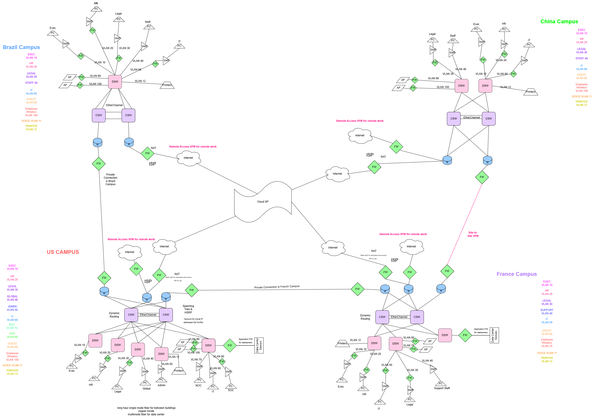

<h1 align="center"> ── .✦ Network Defense Project ✦. ── </h1>

Secure Global Enterprise Network Architecture

##  Overview

I designed a secure enterprise network for a simulated multinational company as part of my Security in Networks course.

The professor gave us a set of high-level business and technical requirements that were intentionally open-ended so that each student could approach the problem in their own way. This project was a fun challenge because of that, as I had to design everything from the secure architecture and inter-site connectivity to access controls and monitoring, and present my reasoning.

##  Network Architecture

- Multi-site design across four regions: United States, Brazil, China, and France
- VLAN segmentation to keep departments isolated and reduce attack surface
- Hybrid connectivity using a mix of private connections and site-to-site VPN tunnels
- Controlled access policies for cloud and internet-bound traffic

##  Security Implementation

- Firewalls restricting inter-campus traffic
- Site-to-site VPN for encrypted communication between sites
- VLAN segmentation to limit lateral movement between departments
- Access Control Lists (ACLs) enforcing least privilege
- Multi-Factor Authentication (MFA) and IAM controls
- Encryption for data in transit and at rest

##  Monitoring & Defense

- SIEM for centralized logging and analysis
- EDR for endpoint protection
- NDR for network-level threat detection
- NAC for device access control

##  Design Considerations

One of the more interesting design challenges was handling the China campus, which I connected to via a controlled VPN to reflect the reality of operating in a region with strict network restrictions. The core campuses (US, Brazil, France) use direct or private connections for better reliability. 

##  Network Diagram

##  Project Files

⟡ [Network Diagram](diagrams/network-diagram.png)

⟡  [IP Addressing Plan](planning/ip-address-cutsheet.xlsx)

⟡  [Security Policies](docs/security-policies.md)

##  Summary

- Translated high-level requirements into a full network design from scratch
- Built security controls into the architecture from the start, not as an afterthought
- Wrote supporting security policies and access control documentation
- Designed an IP addressing scheme that stays organized and scales cleanly
- Applied defense-in-depth across the whole network
